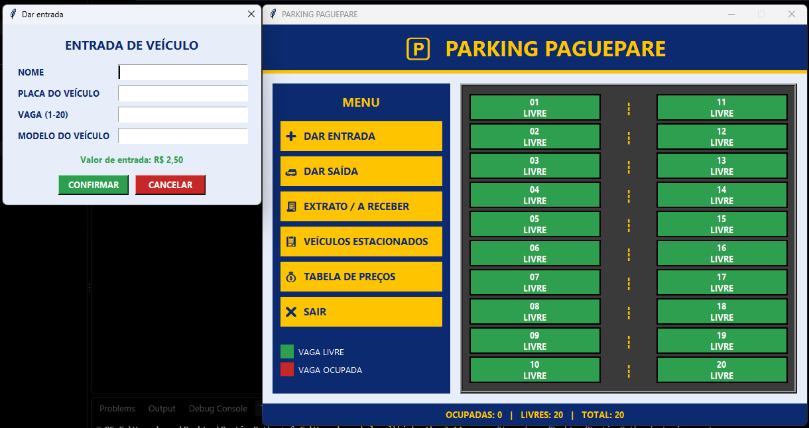
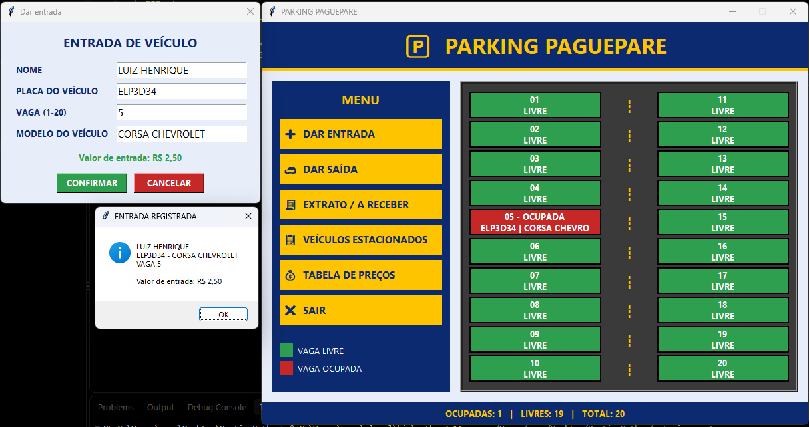
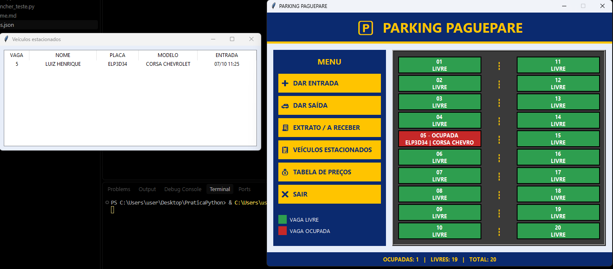
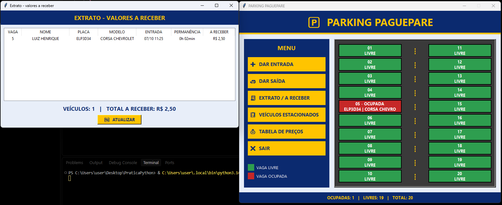
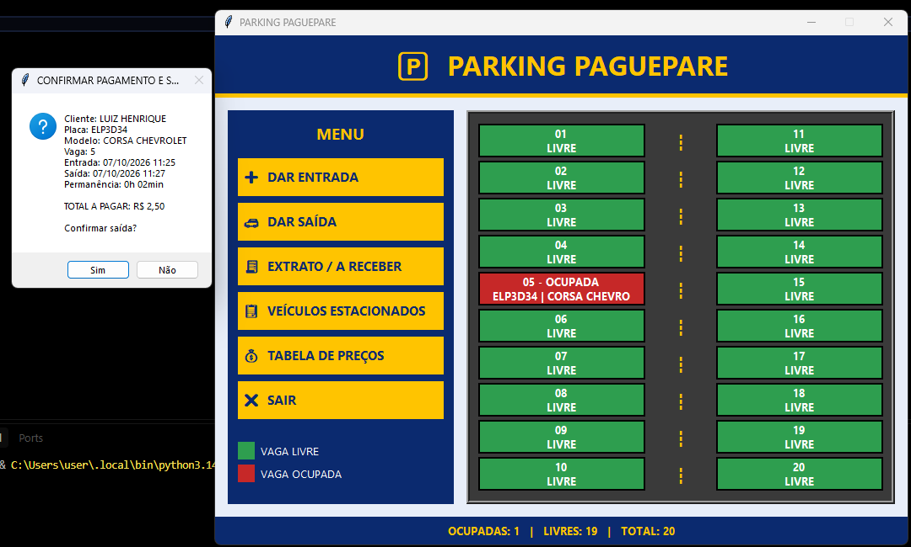
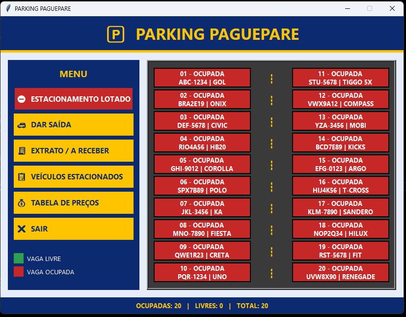
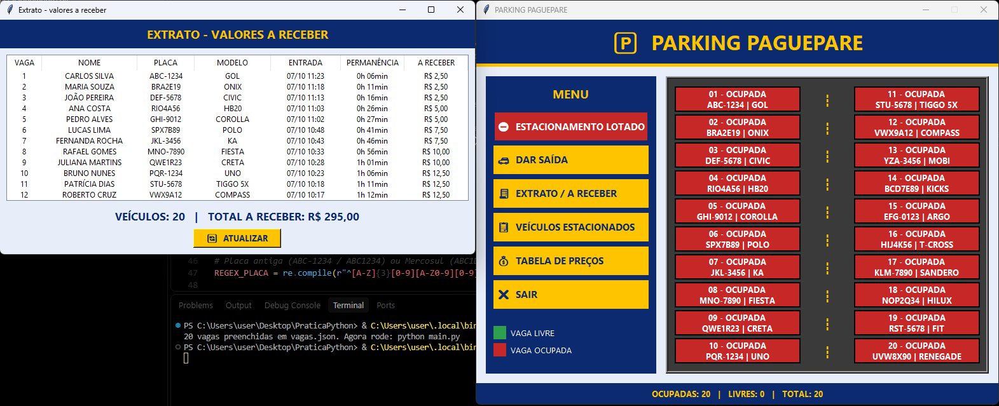
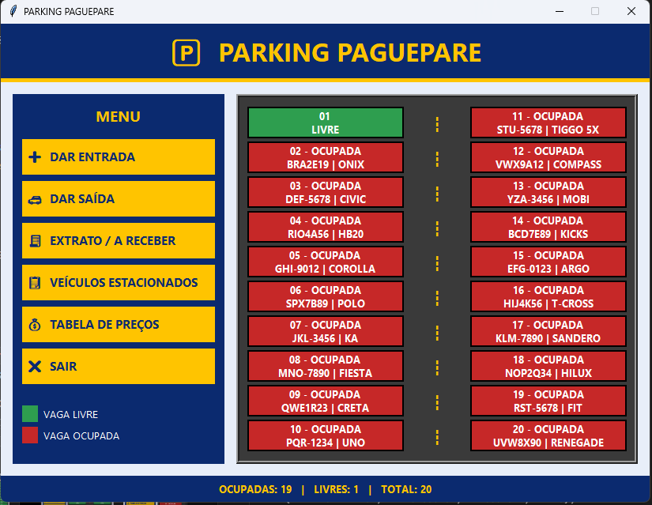

# 🅿 Parking PaguePare

Sistema de estacionamento com interface gráfica feito em **Python + Tkinter**, criado para praticar lógica de programação, validação de dados e construção de telas.

O sistema mostra o mapa de 20 vagas em tempo real, controla a entrada e a saída dos veículos, calcula o valor a pagar e mantém um extrato do que cada carro deve até o momento.



---

## ✨ Funcionalidades

- Mapa visual com **20 vagas** (1 a 10 à esquerda, 11 a 20 à direita), com pista no meio
- **Verde** para vaga livre e **vermelho** para vaga ocupada, mostrando placa e modelo do carro
- Entrada de veículo com nome, placa, vaga e modelo
- **Validações** em todos os campos, com o cursor indo direto para o campo com erro
- **Todo texto digitado vira maiúsculo** automaticamente
- Botão **Dar entrada some quando o estacionamento está lotado** e volta quando uma vaga é liberada
- Saída com resumo e cálculo do valor
- **Extrato** com o valor a receber de cada veículo e o total
- Lista de veículos estacionados
- Dados salvos em arquivo, então nada se perde ao fechar o programa

---

## 🖥️ Como funciona

### 1. Dar entrada

O botão **Dar entrada** abre o formulário. Também é possível clicar direto em uma vaga verde, e o número dela já vem preenchido. Ao confirmar, a vaga fica vermelha e o sistema mostra o resumo, incluindo o valor de entrada de **R$ 2,50**.



### 2. Verificações feitas na entrada

Os campos são validados na ordem da tela. Se algo estiver errado, aparece um aviso e o cursor vai para o campo com problema, com o texto já selecionado.

| Campo                 | O que é verificado                                                                                                                    |
| --------------------- | ------------------------------------------------------------------------------------------------------------------------------------- |
| **Nome**              | Não pode ficar vazio e precisa ter pelo menos 2 letras                                                                                |
| **Placa**             | Não pode ficar vazia. Precisa ser válida: modelo antigo (`ABC-1234`) ou Mercosul (`ABC1D23`). Aceita com ou sem hífen e em minúsculas |
| **Placa (duplicada)** | Se o mesmo veículo já está estacionado, o sistema avisa em qual vaga ele está                                                         |
| **Vaga**              | Precisa ser um número entre 1 e 20                                                                                                    |
| **Vaga (ocupada)**    | Se a vaga escolhida já tem carro, aparece o aviso _"A vaga X está ocupada!"_                                                          |
| **Modelo**            | Não pode ficar vazio                                                                                                                  |

Tudo o que o usuário digita é convertido para maiúsculo na hora, inclusive o campo de saída.

### 3. Consultar os veículos

**Veículos estacionados** lista todos os carros que estão no estacionamento, com vaga, nome, placa, modelo e hora de entrada.



Clicar em uma vaga vermelha também mostra os dados do cliente, o tempo de permanência e o valor até agora.

### 4. Extrato (valores a receber)

O **Extrato** mostra, para cada veículo, quanto tempo ele está no estacionamento e quanto ele deve neste momento. Embaixo aparece o **total a receber**. O botão **Atualizar** recalcula tudo com a hora atual.



### 5. Dar saída

Em **Dar saída**, o usuário informa o número da vaga. O sistema mostra o resumo com horário de entrada, horário de saída, permanência e **total a pagar**. Ao confirmar, a vaga é liberada.



### 6. Estacionamento lotado

Quando as 20 vagas estão ocupadas, o botão **Dar entrada** desaparece do menu e dá lugar ao aviso **ESTACIONAMENTO LOTADO**. Assim ninguém consegue tentar cadastrar um carro sem vaga disponível.



O extrato continua funcionando normalmente com todas as vagas ocupadas:



### 7. Vaga liberada, entrada disponível de novo

Assim que um veículo sai, a vaga volta a ficar verde, o contador do rodapé é atualizado e o botão **Dar entrada** reaparece no menu.



---

## 💰 Regras de cobrança

- Quem entra **já paga o primeiro bloco**: R$ 2,50
- Cada bloco de **15 minutos** custa **R$ 2,50** (equivale a **R$ 10,00 por hora**)
- Existe uma **tolerância de 5 minutos** sobre cada bloco completo. Se o cliente passar só um pouco de um bloco, ele não paga o bloco seguinte

| Permanência | Valor    | Motivo                                        |
| ----------- | -------- | --------------------------------------------- |
| 5 min       | R$ 2,50  | Mínimo: o primeiro bloco é cobrado na entrada |
| 25 min      | R$ 2,50  | 1 bloco + 5 min de tolerância                |
| 26 min      | R$ 5,00  | Passou da tolerância, entra o 2º bloco        |
| 1h00        | R$ 10,00 | 4 blocos                                      |
| 1h05        | R$ 10,00 | 4 blocos + 5 min dentro da tolerância         |
| 1h11        | R$ 12,50 | Passou da tolerância, entra o 5º bloco        |

Os valores ficam nas constantes no topo do código (`VALOR_BLOCO`, `MINUTOS_BLOCO` e `TOLERANCIA_MIN`), então é fácil ajustar a regra.

---

## 🚀 Como rodar

Requisitos: **Python 3.8 ou superior**. O Tkinter já vem instalado no Windows e no macOS. No Linux:

```bash
sudo apt install python3-tk
```

Para executar:

```bash
python main.py
```

---

## 🧪 Preencher todas as vagas para testar

O arquivo `preencher_teste.py` cadastra 20 veículos de uma vez, com tempos de permanência variados. Serve para testar o estacionamento lotado, o extrato e a tolerância sem precisar cadastrar um por um.

```bash
python preencher_teste.py
python main.py
```

> ⚠️ O script **sobrescreve** o `vagas.json`. Para limpar tudo depois, apague esse arquivo.

---

## 📁 Estrutura do projeto

```
.
├── main.py               # Sistema completo (interface e regras)
├── preencher_teste.py    # Preenche as 20 vagas para teste
├── vagas.json            # Dados salvos (criado automaticamente)
├── docs/                 # Imagens usadas neste README
└── README.md
```

O `main.py` é organizado em seções comentadas: configurações, funções de regra, persistência, campo em maiúsculo, janela de entrada e tela principal.

---

## 🛠️ Tecnologias

- Python 3
- Tkinter (interface gráfica)
- JSON (armazenamento dos dados)

---

## 🔮 Próximos passos

- Histórico de pagamentos e relatório de faturamento por dia
- Banco de dados SQLite no lugar do JSON
- Testes automatizados para `calcular_valor` e `placa_valida`
- Tipos de veículo com tabelas de preço diferentes
